Puntos de ejección 

NOTA: ESTA ACTIVIDAD FUE REALIZADA PARA HECHOS EDUCATIVOS

1.- Acceder a Mutillidae II

1.1.- En la aplicación de Burpsuit nos dirigimos a Proxy > Proxy settings.
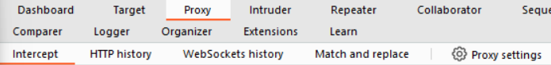
1.2.- Una vez ingresando a la configuración del Proxy, habilitamos las opciones de "Intercept responses bases on the following rules:" en la secciones de "Response interception rules".
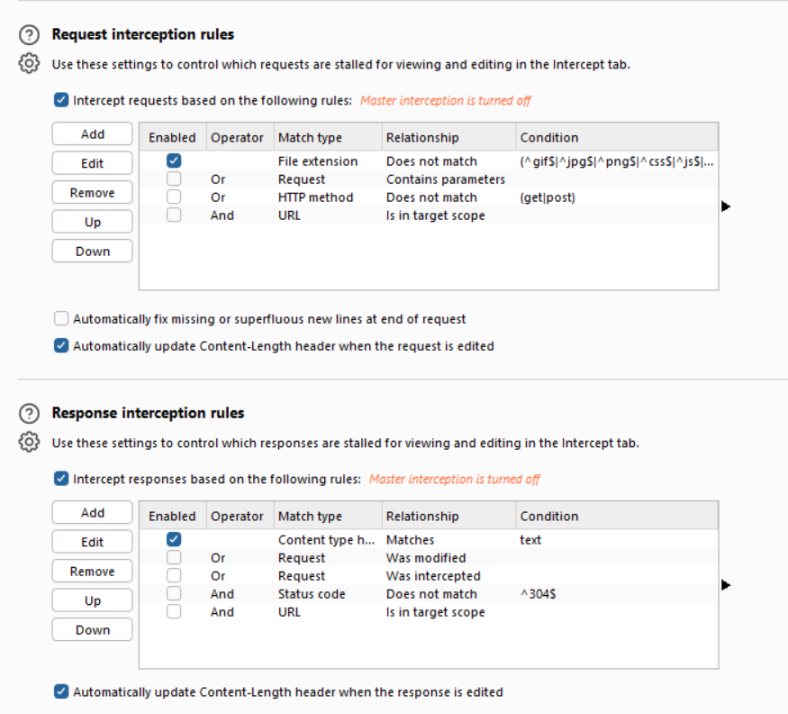
1.3.- Cerramos la sección de configuracion del proxy, y seleccionamos el "open browser" el cual nos abrira el chromium.
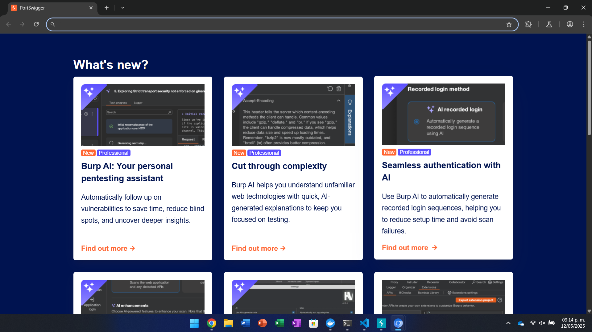

2.- Registro y Logeo del Usuario

2.1.Ingresamos a "localhost" en donde nos abrira el Mutillidae, en el accedemos a Owasp 2017 > AI - Injection (SQL) > SQLi Extract Data > User Info (SQL) > Please register here.
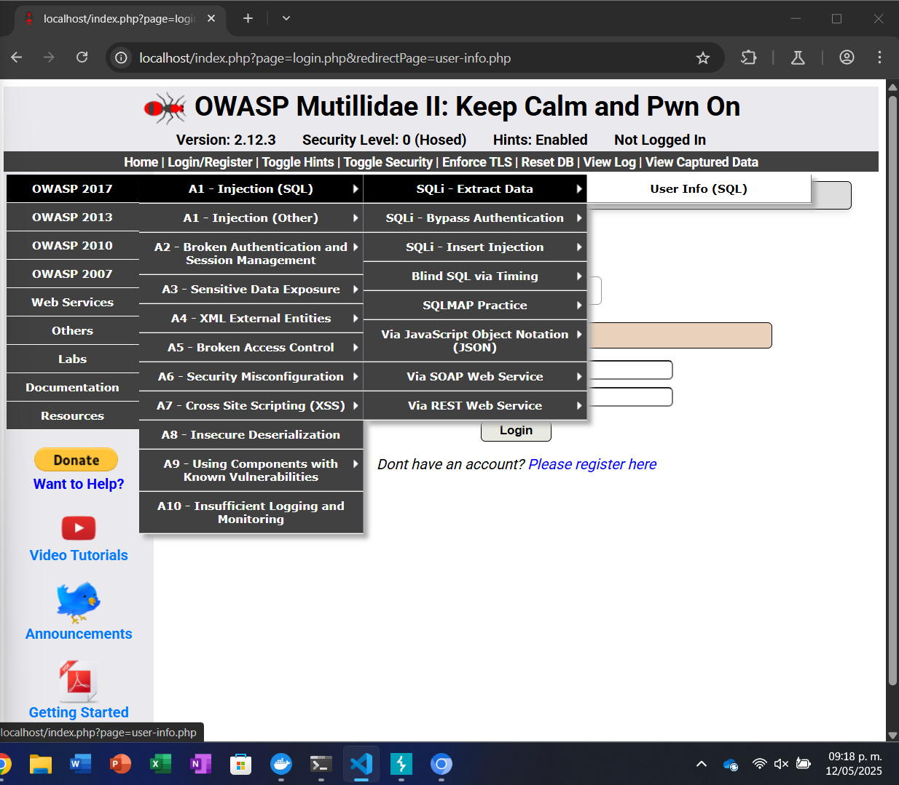
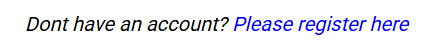
2.2.- Creamos un usuario con su respectiva contraseña (En mi caso yo acomplete los demás campos con el nombre de usuario)
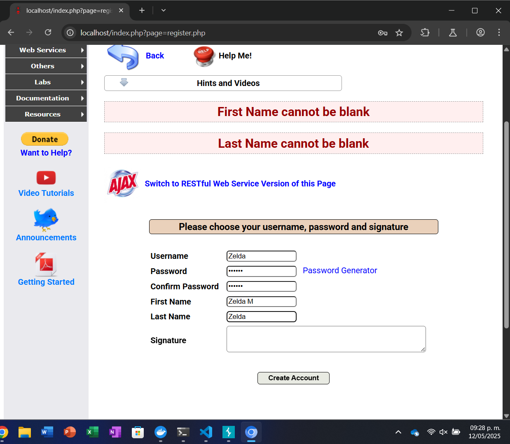
2.3.- Al seleccionar Create Account, volvemos a User Lookup (SQP) ingresamos los datos de la nueva cuenta y damos click en "View Account Details"
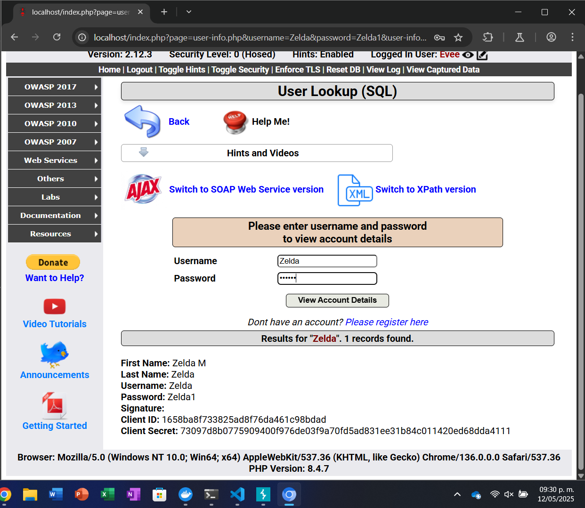
nota: En la parte inferior podremos observar toda la información sobre la cuenta que fue creada anteriormente.

3.- Canario y Cookie

3.1 En BurpSuit activamos la intercepción en la cual, cada vez que se envie una consulta, el sistema lo interceptara y nos mostraran los datos que se estan enviando al servidor, para este caso colocaremos una cuenta no creada dentro del sistema.
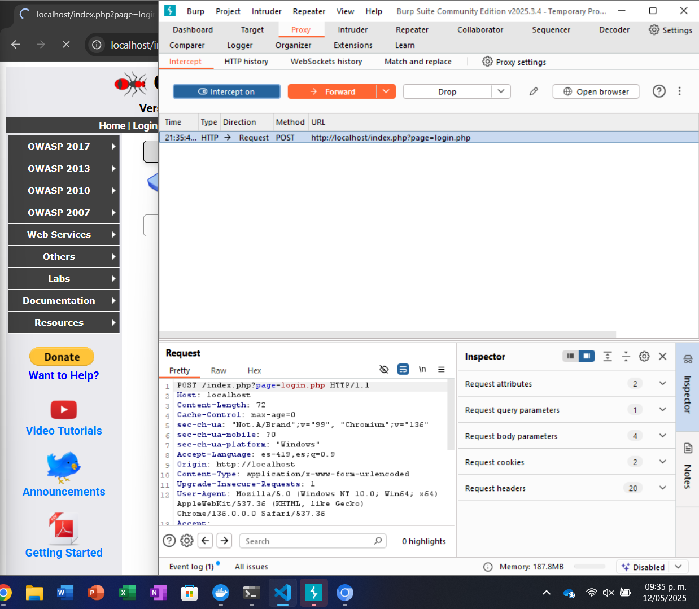
3.2 Podemos observar que la consulta fue interceptada por el sistema, ahora podemos ver la información, en este caso para realizar el canario (El cual es cambiar los datos del dentro del request), en este caso buscamos la información del login.
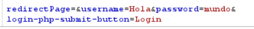
3.3 Cambiamos esos datos por los de una cuenta ya creada y le damos en Forward.
3.4.- Al realizar esto podemos observar lo que el servidor estaria respondiendo, que seria los datos del loggeo exitoso al cambiar los datos, ahora, dentro del mismo podemos cambiar el cookie dentro del inspector y Response headers, cambiando el UID, el cual consiste en los permisos de cada usuario correspondiente.
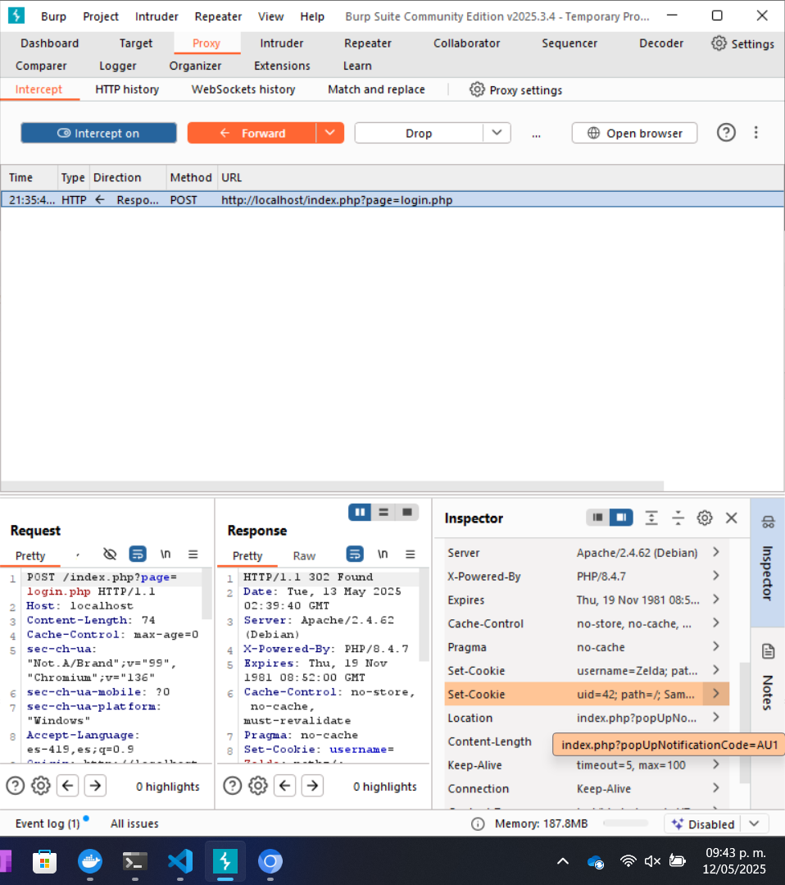
3.5.- Cambiamos el UID que en este caso de 42 pasa a 1, aplicamos cambios y damos forward.
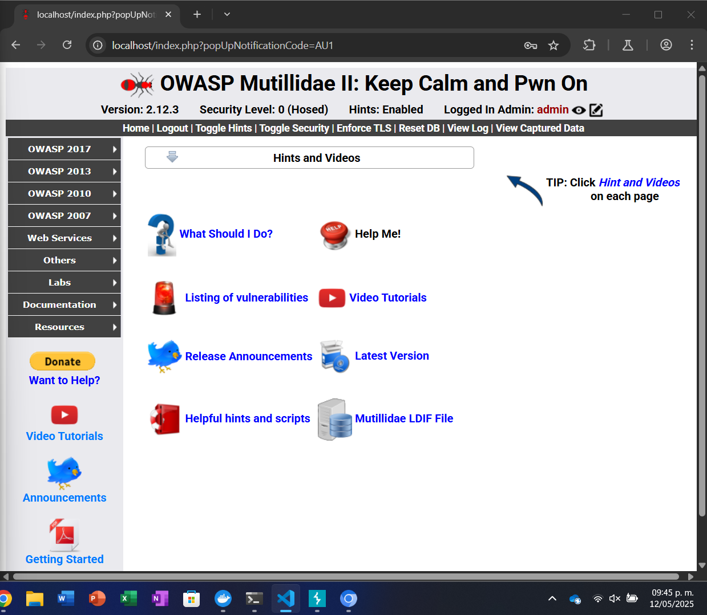

Nota: Podemos observar que nos ingreso al usuario Admin, esto se debe al cambio del UID, el nuestro que era 42, unicamente teniamos acceso a ciertos permisos, mientras que el 1 le pertenece al Admin tenemos acceso a todo lo que el usuario tiene permitido.
