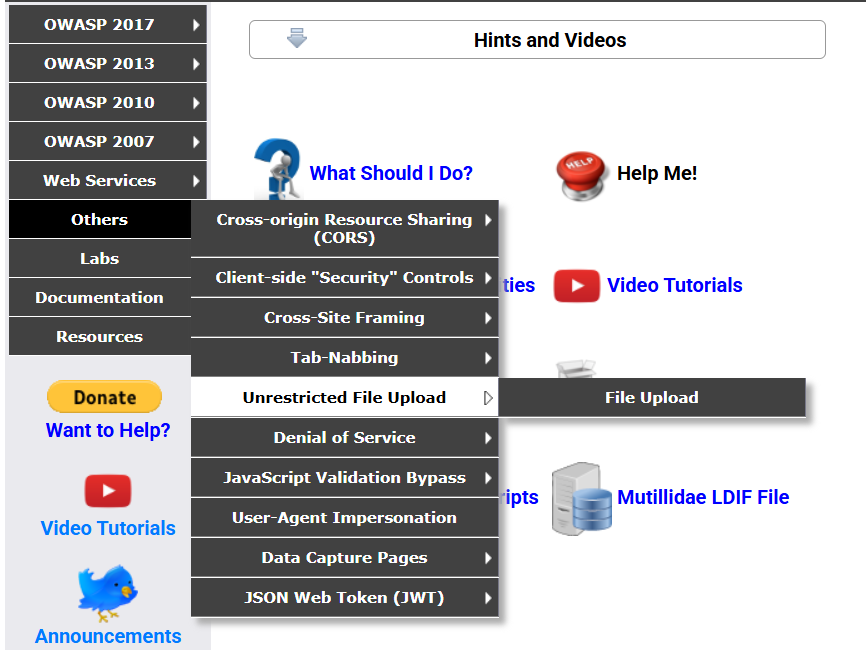

NOTA: ESTA ACTIVIDAD FUE REALIZADA CON FINES EDUCATIVOS.

1.- Crear Webshell la cual nos dara el correo, contraseña y el useragent.

2.- Subimos el archivo en mutillidae.

3.- Accedemos al contenedor en el cual se encuentra mutillidae y realizamos el movimiento de archivo desde el origen en el cual fue subido y movido de forma automatica por el mutillidae hacia la ruta en la cual se encuentra la página de mutillidae para poder ingresar mediante el URL como lo muestra en la segunda imagen.

4.- Crear la base de datos y tabla en PhpMyAdmin.

5.- Verificar el funcionamiento.

Nota: Error en base de datos: La investigación que realice, arroja que el mysql del phpmyadmin no esta enlazado hacia el contenedor de docker en el cual se encuentra el Mutillidae. (Encontre algunas soluciones, sin embargo aun sigue permaneciendo el error).
