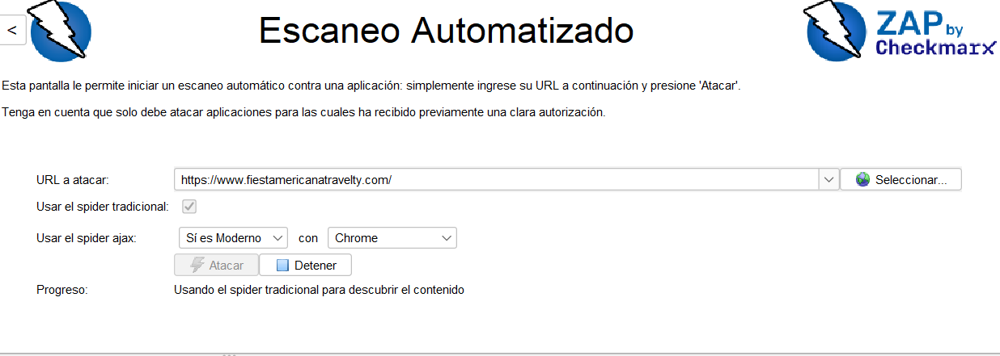
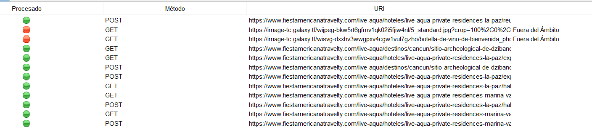
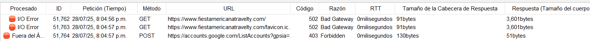
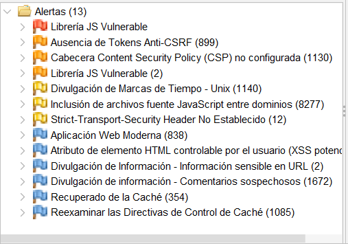

1.-Se inicia el escaneo ingresando la URL del sitio a analizar en la sección de “Escaneo Automatizado” de ZAP (https://www.fiestamericanatravelty.com/).

2.-Para explorar el sitio, se activan dos métodos de rastreo: el spider tradicional, que recorre enlaces estáticos, y el AJAX Spider, que usa un navegador (Chrome) para detectar contenido dinámico generado por JavaScript.

3.-Al presionar “Atacar”, ZAP comienza a explorar automáticamente el sitio con ambos spiders, recopilando URLs, formularios y recursos disponibles.

4.-Durante este proceso, se registran todas las solicitudes HTTP realizadas (tanto GET como POST), incluyendo rutas internas del sitio y recursos externos. ZAP muestra cuáles solicitudes se procesaron correctamente (en verde) y cuáles fallaron (en rojo), generalmente por estar fuera del dominio establecido.

5.-Posteriormente, el AJAX Spider permite descubrir rutas adicionales que no fueron detectadas por el rastreo tradicional, lo que mejora la cobertura del análisis.

6.-Una vez completado el rastreo, ZAP realiza un análisis automatizado de seguridad sobre los elementos encontrados. Los resultados se presentan mediante alertas codificadas por color: rojo para vulnerabilidades críticas, naranja para riesgos altos, amarillo para advertencias o malas prácticas, y azul para información general relevante.
