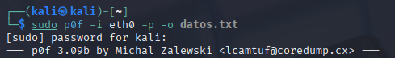
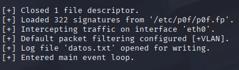
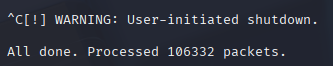

1.-Se abre una terminal con privilegios de superusuario.

2.-Se identifica el nombre de la interfaz de red activa.

3.-Se ejecuta el siguiente comando.
    3.1.-sudo p0f -i eth0

4.-p0f empieza a escuchar el tráfico que pasa por la red sin generar paquetes, analizando encabezados TCP de conexiones entrantes o salientes.

5.-Los resultados se muestran en tiempo real en la terminal, y la herramienta continúa ejecutándose hasta que se detiene manualmente con Ctrl + C.
