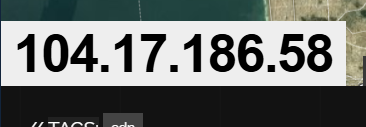
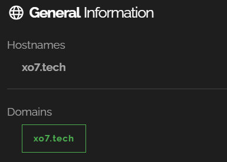
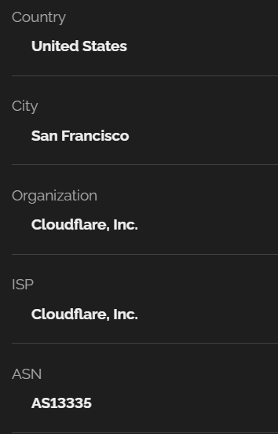
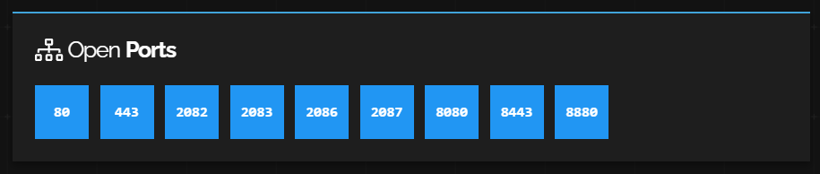

1.-Se accede al sitio de Shodan.

2.-En el buscador se introduce la dirección IP pública del servidor o dispositivo que se desea analizar.

3.-En los resultados se visualiza el nombre de dominio asociado si existe un registro DNS inverso vinculado a esa IP.

4.-Más abajo, se encuentra la sección de datos WHOIS, donde se detalla información administrativa como el nombre del proveedor o ISP, país, rango de direcciones IP, y contactos técnicos o administrativos cuando están disponibles.

5.-También se listan los puertos abiertos y los servicios detectados en cada uno.
