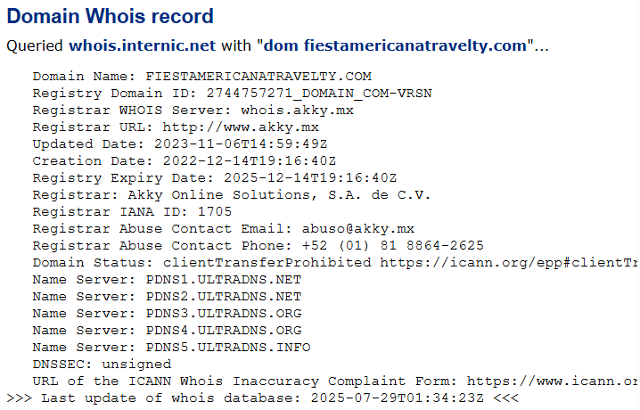

1.-Se accede al sitio web de Shodan e inicia sesión en caso de tener una cuenta.

2.-En la barra de búsqueda principal, se ingresa la dirección IP pública del servidor o sistema que se desea analizar.

3.-Shodan realiza una búsqueda en su base de datos y muestra un panel con información recopilada del objetivo. Esta información proviene de escaneos realizados por Shodan sobre servicios públicos expuestos en internet.

4.-En los primeros resultados se muestra el nombre de dominio asociado, en caso de que exista un registro inverso DNS para esa IP.

5.-Más abajo, Shodan presenta la sección de datos WHOIS, donde se pueden consultar detalles administrativos de la IP consultada. Estos datos pueden incluir el nombre del proveedor o ISP (organización), el país y la ubicación aproximada del servidor, el rango de direcciones IP al que pertenece, información de contacto técnico y administrativo si está disponible públicamente, y la fecha de asignación o actualización del bloque IP.

