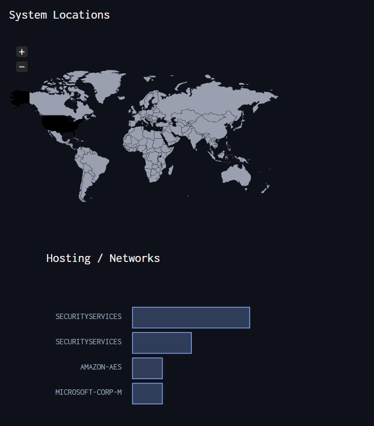
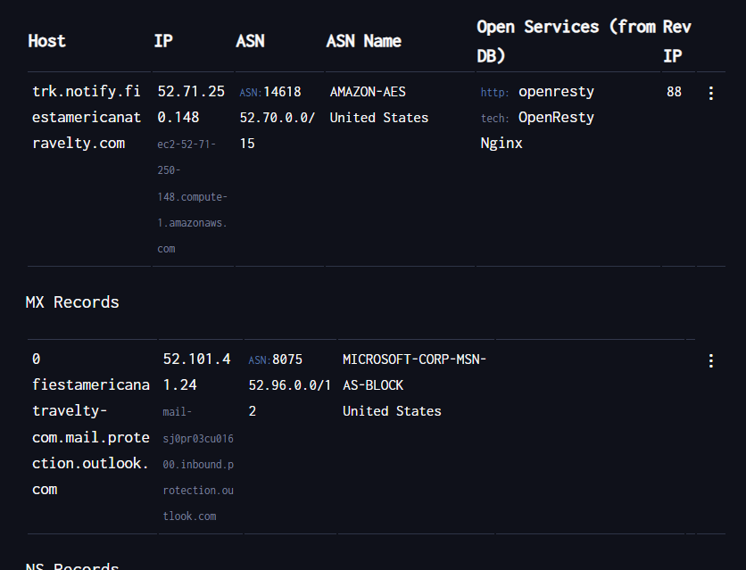
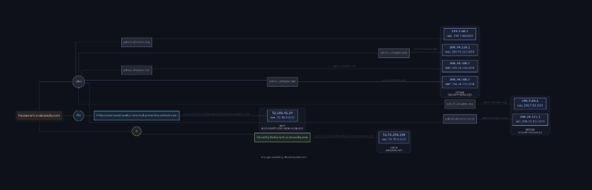

1.- Se accede al sitio de DNSDumpster, una herramienta de reconocimiento pasivo para recolectar información relacionada con los registros DNS de un dominio.

2.-En el campo de búsqueda se introduce el nombre de dominio del objetivo que se desea analizar.

3.-Al ejecutar la consulta, DNSDumpster inicia un proceso de recolección de datos públicos asociados al dominio mediante fuentes abiertas.

4.-Los resultados incluyen registros DNS como A (direcciones IP), MX (servidores de correo), TXT (verificaciones y políticas), NS (servidores de nombres) y registros relacionados con subdominios.

5.-También se presentan direcciones IP asociadas a cada subdominio, junto con su proveedor de hosting, sistema autónomo (ASN), país y organización.

6.- En muchos casos, se genera un mapa visual que representa gráficamente la infraestructura del dominio, mostrando la relación entre subdominios, servidores y servicios detectados.

