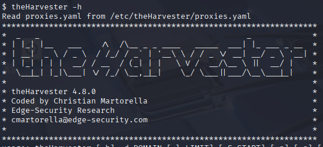
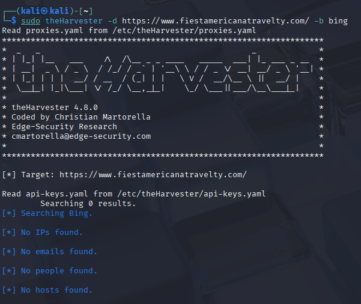
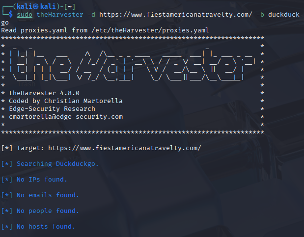

1.-Se abre una terminal en el sistema donde esté instalado theHarvester.

2.-Se define el dominio objetivo del cual se desea extraer información.

3.-Se ejecuta el comando theHarvester -d página.com -b fuente, donde “fuente” puede ser bing, duckduckgo, etc.

4.-theHarvester realiza búsquedas automáticas en la fuente seleccionada, recolectando datos como correos electrónicos, subdominios y hosts relacionados.

5.-Al finalizar, la herramienta muestra un resumen de la información recolectada en pantalla o en el archivo generado. El cuál la herramienta no encontro nada.

